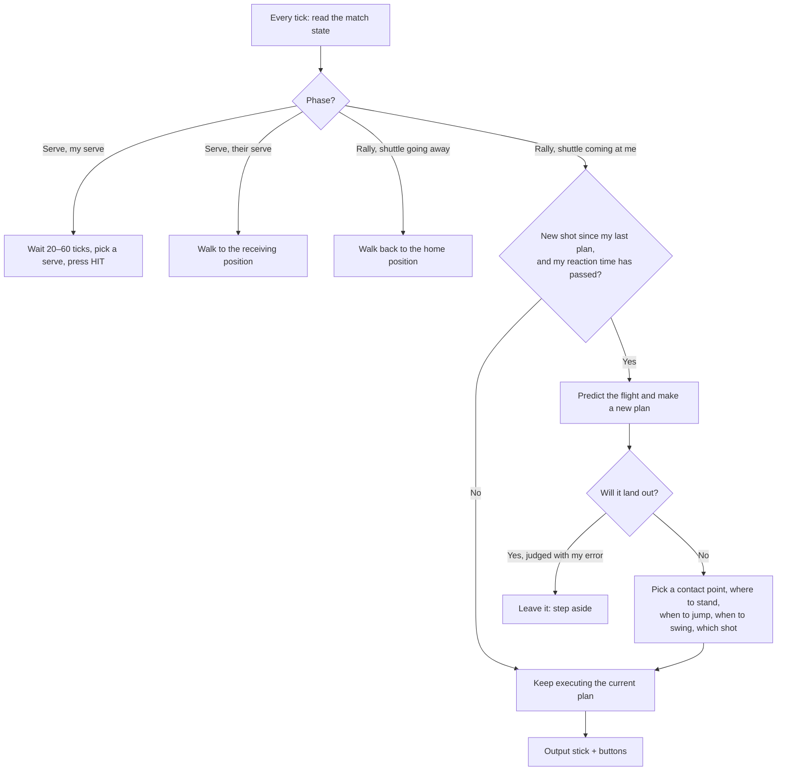

# How the bots and seeds work

This document describes how the computer players ("bots") think, and how seeds make every
match reproducible. It reflects the code as of milestone M2 (weapons). Personalities arrive in M3.

- Bot code: `packages/bots/src/bot.ts`, difficulty profiles in `packages/bots/src/profiles.ts`
- Seeds and randomness: `packages/sim/src/math/prng.ts`, used by `packages/sim/src/rules/match.ts`

---

## Part 1 — Seeds and determinism

### What a seed is

A seed is a single 32-bit number (0 to 4 294 967 295) that fixes every random choice in
a match. The simulation never calls `Math.random()`. It uses its own random number
generator (**sfc32**), whose whole state is four 32-bit integers stored inside the match
state (`state.rng`). `createMatch(config, seed)` turns the seed into that state.

**Same seed + same settings + same inputs → bit-for-bit the same match.** This holds on
any device and in any browser.

### What the seed decides

| Random choice                      | When it is drawn             |
| ---------------------------------- | ---------------------------- |
| Who serves first (coin toss, R-10) | Once, at `createMatch`       |
| Wind strength and direction        | At the start of every rally  |
| Shot error from imperfect timing   | On every hit                 |
| _(M2)_ crate drops, crate contents | Between rallies              |
| _(M2)_ cluster bomblet spread      | When a cluster shuttle lands |

Wind is drawn uniformly between −`windMax` and +`windMax` for the arena (±1 m/s in the
Sports Hall) and rounded to 0.1 m/s.

Shot error works like this. Each hit gets a **quality** between 0 and 1 from the swing
timing and the racket distance (`contactQuality` in `match.ts`). The error scale is
`1 − quality`. The generator then draws two numbers between −1 and +1: one shifts the
target landing depth, the other tilts the launch angle. A perfect hit has no error; a
poor one can go long, short or into the net.

### What the seed does _not_ decide

- **Your inputs.** In a game against a bot, the match depends on the seed _and_ on exactly
  what you pressed on each tick, so a seed alone can't replay your match. Recording the
  inputs too will make that possible; that's the replay feature planned for M3.
- **Visual effects.** Particles, screen shake and the short freeze after a smash use
  ordinary randomness and timing in the renderer. They never feed back into the
  simulation, so they can't change the outcome.

### Bots have their own seeds

Each bot owns a separate sfc32 generator, used for its "human" mistakes (reaction
noise, positioning error, shot choice). In the web client:

- The match gets a random seed `S`.
- The bot playing as player 1 (left) is seeded with `S`, and the bot playing as player 2
  (right) with `S + 1`. Inside, each bot also mixes in a fixed constant per side, so two
  bots never share a random sequence.

Because bots are deterministic too, **a bot-vs-bot match is fully reproducible from its
seed, the two difficulties, the points setting and the tuning values.** Watch mode shows the
seed in its toolbar.

To replay one, open the game with `?seed=<number>` in the URL, for example
`https://<your-deployment>/?seed=2120707762`. Then choose WATCH BOTS with the same
difficulties and points. Every match you start in that tab uses that seed (the bots playing
behind the title screen still get random ones).

### Why this matters

| Use              | How the seed helps                                                                                             |
| ---------------- | -------------------------------------------------------------------------------------------------------------- |
| Balance testing  | `simbatch` plays thousands of seeded bot matches and the results are repeatable                                |
| Bug reports      | "Seed 123, Hard vs Medium, ball goes through the net at 5–3" can be replayed exactly                           |
| Replays (M3)     | A replay file is just the seed, the settings and the list of inputs: a few KB                                  |
| Online play (M5) | Both players run the same simulation and exchange only inputs; the shared seed keeps wind and errors identical |
| Tests            | The determinism tests run the same seed twice and compare a hash of the whole state                            |

### How determinism is enforced

- **Fixed timestep.** The simulation advances in ticks of exactly 1/60 s, regardless of
  frame rate. The renderer interpolates between ticks for smooth drawing.
- **No engine-dependent math.** `Math.sin`, `Math.cos`, `Math.atan2`, `Math.pow` and
  similar functions can return slightly different results in Chrome (V8) and Safari
  (JavaScriptCore). The simulation uses its own versions built only from `+ − × ÷` and
  `Math.sqrt`, which are exact everywhere. ESLint blocks the unsafe functions and
  `Math.random()` in `packages/sim` and `packages/bots`.
- **No clocks.** No `Date`, no `performance.now()` in the simulation.
- **Plain data.** The match state is plain JSON-like data, so it can be copied
  (`snapshot`) and hashed (`hashState`). Tests check that two runs with the same seed
  produce the same hash, and that saving and restoring mid-match changes nothing.

### Seeds in `simbatch`

```bash
npm run simbatch -- --a hard --b medium --n 200 --seed 1
```

Match `i` (counting from 0) uses seed `seed + i × 7919`. Running the same command twice
gives the same report. Change `--seed` to get a different, but still repeatable, sample.

---

## Part 2 — How the bots think

### The one rule: bots play by the same rules as you

A bot is just another **input source**. Every tick (60 times a second) it reads the match
state and returns the same kind of input a keyboard, gamepad or touch screen produces:
stick left/right, stick up/down, and the jump and hit buttons. The simulation can't tell
a bot from a human.

Bots read only information a human could see: positions, velocities, wind, score. They
never read the opponent's inputs, and they cannot change the match state directly.

### Seeing the shuttle: prediction

The bot's main skill is **prediction**. `predictShuttle(state)` runs a copy of the
shuttle's flight forward, tick by tick, using the exact same physics as the game (drag,
wind, the net). It returns the shuttle's path until it lands. A skilled human does the
same thing by reading the flight; the bot just does it with math, and then adds
deliberate mistakes depending on its difficulty.

### The decision loop



### Step by step

**1. Reaction delay.** After the opponent hits, the bot does nothing new for
`reactionTicks` (for example 14 ticks ≈ 0.23 s on Medium). Then it plans once for that
shot. A new hit by the opponent means a new plan.

**2. Should I leave it?** If the predicted landing point is on the bot's own side and
beyond the baseline, the bot considers letting it fall out. It judges the landing point
with its `predictionError`, so a weaker bot misjudges more. It leaves the shot only with
probability `shotIQ`. When leaving, it steps 0.8 m away so the shuttle doesn't hit its
body (a body hit would lose the point, R-22).

**3. Choose the contact point.** For each predicted point on the bot's side between
0.3 m and 3.0 m high:

- Work out where to stand so the shuttle meets the racket's sweet spot in front of the body.
- Check whether the bot can get there in time, running at `footwork × run speed`, with
  6 ticks of slack for acceleration and the swing.
- Among the reachable points, prefer the **highest** one (up to 2.8 m), because high
  contacts allow attacking shots. Jumping costs a small penalty, so the bot jumps only
  when it's worth it.

If nothing is reachable in time, it goes for the point it misses by the least and hopes.

**4. Add human mistakes.**

- **Positioning error:** the standing position is shifted by up to ±`predictionError` meters.
- **Timing error:** the swing is pressed up to ±`timingNoise` ticks early or late. The
  ideal moment is 5 ticks before contact, which is when the racket is at its best.
- **Jump timing:** if the contact point is above 2.3 m, the bot jumps a computed number
  of ticks before contact, so it is rising through the right height when it swings.

**5. Choose the shot.** The bot picks a direction to hold while swinging, which picks the
shot just as it does for you:

- With probability `1 − shotIQ`: a random direction (a "bad decision").
- Otherwise, in this order:
  1. The contact is high (≥ 2.3 m) and not too deep: **smash**, with probability `aggression`.
  2. The opponent is deep (more than 4.6 m from the net): **drop** it short.
  3. The opponent is close to the net (less than 3 m): **clear** it over their head.
  4. The contact is low: mostly **lift**, sometimes a net shot when close to the net.
  5. Otherwise: a random choice of clear, drop or drive.

**6. Serving.** The bot waits a random 20–60 ticks (0.3–1 s), then serves: short 50% of
the time, high 35%, flick 15%.

**7. Between shots.** When the shuttle is heading away, the bot returns to its home
position, 3.3 m from the net. It moves with a proportional controller: full speed when
far, slowing down as it arrives.

### Difficulty levels

| Setting           | What it does                                    | Easy        | Medium      | Hard      |
| ----------------- | ----------------------------------------------- | ----------- | ----------- | --------- |
| `reactionTicks`   | Delay before reading a new shot                 | 22 (0.37 s) | 14 (0.23 s) | 6 (0.1 s) |
| `predictionError` | Max positioning error, meters                   | 0.6         | 0.3         | 0.05      |
| `footwork`        | Fraction of full running speed                  | 70%         | 85%         | 100%      |
| `timingNoise`     | Max swing timing error, ticks                   | 2.5         | 1.2         | 0.4       |
| `shotIQ`          | Chance of a sensible shot (and of leaving outs) | 35%         | 65%         | 92%       |
| `aggression`      | Chance to smash when a smash is available       | 30%         | 60%         | 85%       |

Medium vs Medium currently averages about 9 shots per rally and 3.5-minute matches to 11.

### Watching a bot think

In WATCH BOTS, press **AI INTENT**:

- **Faint dots** show the predicted flight of the shuttle.
- **A colored tick on the floor** shows where each bot has decided to stand for its next
  contact. When it's off, the bot made a positioning error, or the shot is a surprise
  it hasn't reacted to yet.

### Weapons (M2)

On top of the rally logic above, bots use the arsenal:

- **Loading shots.** When planning a return of a standard shuttle, the bot loads a weapon
  with probability `weaponUse`, choosing by weight: Frag 3, Lead 2, Shock 2, Cluster 1,
  Ghost 1 (only those with ammo and unlocked). For a Frag it picks a 2–4 s fuse. It cycles
  the selection with the weapon buttons on alternate ticks, exactly like a human tapping.
- **Hot potato.** If an incoming Frag would explode before (or within 15 ticks after) the
  planned contact, the bot doesn't return it: it runs out of the blast radius instead.
- **Shock shuttles.** The bot leaves an incoming Shock Shuttle when its HP is low, or
  sometimes when it leads by 3+ points.
- **Ghost shuttles.** The bot can't plan a return while the shuttle is invisible.
- **Mines.** After its own hit, the bot sometimes selects a mine and throws it
  (`weaponUse × 0.5` per shot, at most 2 active). It never plans to stand within 0.9 m of
  a mine on its side.
- **Crates.** Between shots, the bot walks to a landed crate on its half.
- **Craters.** Contact heights are measured from the floor under the bot, so it still
  positions correctly while standing in a crater.

**Revenge Turns.** After a 0.3–0.75 s "thinking" pause, the shooter:

1. Drinks a Medkit if HP ≤ 35.
2. Otherwise tries every combination of weapon (Rocket, Mortar, Homing), angle (5–80°,
   step 5) and power (0–1, step 0.05) in a **copy of the projectile physics**
   (`simulateProjectile`), including wind. Each candidate scores the expected damage to the
   target minus 1.5 × the damage to itself, minus 5 for using limited ammo. The Air
   Strike is scored the same way at the target's position.
3. If nothing scores above 2, it raises a Shield (HP ≤ 60) or skips.
4. Adds human error: up to ±`aimNoise` degrees and ±`powerNoise` charge.
5. Steers the aim with up/down, holds FIRE until the charge reaches the planned power, and
   releases, exactly like a human.

**Dodging.** As the target, the bot notices each incoming projectile with probability
`dodge`, predicts where it will explode (same projectile copy), and runs out of the blast
radius, preferring the net side when it is near a Rooftop pit.

| Setting      | What it does                      | Easy | Medium | Hard |
| ------------ | --------------------------------- | ---- | ------ | ---- |
| `weaponUse`  | Chance to load a weapon shuttle   | 10%  | 22%    | 32%  |
| `aimNoise`   | Revenge aim error, degrees        | 10   | 4      | 1.2  |
| `powerNoise` | Revenge charge error              | 12%  | 5%     | 1.5% |
| `dodge`      | Chance to notice and dodge a shot | 30%  | 70%    | 100% |

### Planned extensions

- **M3: personalities.** Purist (plays for points), Berserker (hunts for KOs) and
  Balanced (expected value) change the weights of those decisions. `simbatch` reports how
  often each personality wins by points versus by KO.
