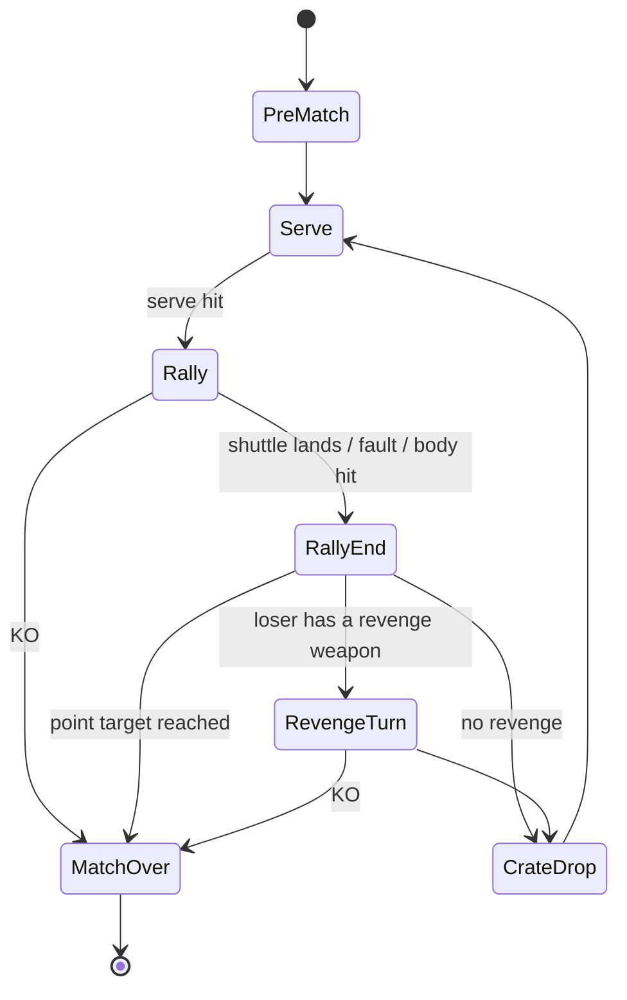

# Deadminton — Game Design Document

> Working title. Status: **approved 2026-10-09** (see the decisions in `ROADMAP.md`). All numbers are _starting tuning values_;
> they will be tuned with headless bot-vs-bot simulations (see `TECHNICAL_PLAN.md`).

## 1. Pitch

Badminton, but the shuttlecock can be a grenade.

Two players stand on opposite halves of a side-view badminton court. You can win **the
honest way** by scoring points in real-time badminton rallies, or **the dishonest way** by
reducing your opponent's health to zero with a Worms-style arsenal: explosive shuttles,
mines, rockets, air strikes, wind, and craters in the court floor.

The tension that drives every decision:

> _Do I return this ticking shuttle and keep the rally alive, or do I concede the point and run?_

## 2. Design pillars

1. **Badminton first.** A match with zero weapons ("Purist" scheme) must still be a fun
   game of badminton. Weapons build on top of a solid rally; they don't replace it.
2. **Two roads to victory.** Points and KO should both be viable. A strong badminton player
   tends to win on points, and a weaker one can fight back with weapons. Target for evenly
   matched balanced bots: **35–65 % of matches end by KO**.
3. **Worms DNA.** Wind, limited ammo, fuse timers, supply crates, destructible ground,
   self-damage, aimed turn-based shots, cartoon deaths with a tombstone.
4. **Readable chaos.** Every threat is visible and telegraphed: fuse timers over shuttles,
   mine blink, crate parachutes, wind arrow, landing markers on easy difficulty.
5. **One input model for every device.** Movement plus two or three buttons, so keyboard,
   gamepad and touch are equal citizens from day one.

## 3. Core loop

1. **Serve.** The player who won the last rally serves (rally-point system).
2. **Rally (real-time).** Move, jump, and hit. Before a hit you may **load** a special
   shuttle, or **throw** a deployable such as a mine.
3. **Rally end.** A point is awarded under the badminton rules in §6.
4. **Revenge Turn (turn-based, Worms-style).** The player who **lost** the point gets one
   aimed shot with an off-hand weapon (rocket, mortar, air strike…) or a utility (medkit,
   shield). The target **can move to dodge** but cannot attack. This is the comeback
   mechanic: being behind on points gives you chances to hurt the leader.
5. **Crate drop.** Sometimes a supply crate parachutes onto the court.
6. Repeat until someone reaches the point target or is KO'd.

## 4. The arena

Side view. The whole court is visible on one 16:9 landscape screen, with no scrolling.

| Element                 | Value                        | Notes                                                          |
| ----------------------- | ---------------------------- | -------------------------------------------------------------- |
| Court length            | 13.4 m (two halves of 6.7 m) | Real singles court length                                      |
| Net height              | 1.55 m                       | Indestructible in MVP                                          |
| Short service line      | 1.98 m from the net          | Serves must land beyond it                                     |
| Run-off behind baseline | 2.0 m                        | Players may retrieve shots here                                |
| Ceiling                 | 10 m (Hall arena)            | Hitting the ceiling is a fault                                 |
| Floor                   | Destructible **heightmap**   | Explosions leave craters that persist for the rest of the game |

### Arenas (MVP: first two)

| Arena               | Wind                                  | Special                                                                               |
| ------------------- | ------------------------------------- | ------------------------------------------------------------------------------------- |
| **Sports Hall**     | Low (±1 m/s, air-conditioning drafts) | Ceiling, walls behind run-off                                                         |
| **Rooftop**         | High (±4 m/s)                         | No ceiling. A **pit** behind each run-off: falling in means instant KO (Worms' water) |
| Beach _(later)_     | Medium                                | Sand floor: craters are deeper, movement is slower                                    |
| Scrapyard _(later)_ | Variable                              | Destructible net                                                                      |

Wind is re-rolled every rally from the match seed and shown as an arrow with strength
bars. Wind affects shuttles strongly, as it does in real badminton, and affects rockets
moderately.

## 5. Players

MVP has one character archetype with cosmetic skins. Character classes with different
stats are planned for later.

| Stat            | Value                                                                |
| --------------- | -------------------------------------------------------------------- |
| HP              | 100 (no regeneration; healing only from medkits and crates; max 100) |
| Run speed       | 5.5 m/s                                                              |
| Jump            | ≈ 0.7 m apex, with a little air control                              |
| Racket reach    | 0.85 m radius from the shoulder                                      |
| Hit cooldown    | 0.25 s (a whiff also costs this)                                     |
| Throw animation | 0.5 s (you cannot hit during it, so throwing mid-rally is risky)     |

**Restrictions on movement**

- Players can never cross the net plane (it acts as an invisible wall).
- **Touching the net** with your body during a rally is a fault. Knockback can push you
  into the net.
- Before serving, the server is locked in their service area. The receiver may move freely
  on their half.

## 6. Rules

Each rule has an ID. The simulation code references these IDs in its tests, so the rules
and the implementation cannot drift apart.

### 6.1 Match format and victory

| ID   | Rule                                                                                                                                                            |
| ---- | --------------------------------------------------------------------------------------------------------------------------------------------------------------- |
| R-01 | **Point victory:** first to **11** points, must lead by 2, hard cap at 15. Options: 7, 11 or 21.                                                                |
| R-02 | **KO victory:** reduce the opponent to 0 HP. The match ends instantly, whatever the score.                                                                      |
| R-03 | **Self-KO** (killed by your own weapon or by falling into a pit) counts as a KO win for the opponent.                                                           |
| R-04 | **Double KO** (both reach 0 HP on the same tick): the player with more points wins. If points are tied, play a **Sudden Death** rally.                          |
| R-05 | **Format:** single game by default; best of 3 is optional. HP carries over between games, with +20 HP at the start of each new game. Craters reset per game.    |
| R-06 | **Time limit** (optional, default 8 min): when time runs out, **Sudden Death** begins. Both players' HP is set to 1, the next point wins, and any damage kills. |
| R-07 | **Forfeit or disconnect** loses the match. Online: after a 20 s reconnect grace period.                                                                         |

### 6.2 Serve

| ID   | Rule                                                                                                                        |
| ---- | --------------------------------------------------------------------------------------------------------------------------- |
| R-10 | The winner of the previous rally serves. A coin toss (from the seed) decides the first serve.                               |
| R-11 | Serves are always **standard shuttles**. You cannot load a weapon on a serve.                                               |
| R-12 | Serves must be underhand: the contact point is below 1.15 m and the launch angle is upward.                                 |
| R-13 | The serve must land in the opponent's half, beyond the short service line and within the baseline. Otherwise it is a fault. |
| R-14 | There is a 5 s serve clock. When it expires, an automatic standard serve is played.                                         |

### 6.3 Rally and points

"Last hitter" means the player who last struck the shuttle.

| ID   | Rule                                                                                                                                               |
| ---- | -------------------------------------------------------------------------------------------------------------------------------------------------- |
| R-20 | The shuttle lands **in** (lines count as in) on the opponent's half: point to the last hitter.                                                     |
| R-21 | The shuttle lands **out**: point **against** the last hitter.                                                                                      |
| R-22 | The shuttle touches a player's **body**: point against that player (real badminton rule), plus any damage from §7.                                 |
| R-23 | The shuttle hits the net and falls on the hitter's side: fault by the hitter. If it trickles over the net, play continues.                         |
| R-24 | **Double hit** (the same player hits twice in a row): fault.                                                                                       |
| R-25 | **Reaching over:** a hit is valid only if the contact point is on your side of the net.                                                            |
| R-26 | **Ceiling or wall** contact (Hall arena): fault by the last hitter.                                                                                |
| R-27 | **Detonation:** a weaponised shuttle that explodes in flight counts as **landing at the floor point directly below it**. R-20 and R-21 then apply. |
| R-28 | Damage does **not** end a rally. Only a KO does (R-02).                                                                                            |
| R-29 | A player who touches the net with their body commits a fault (§5).                                                                                 |

### 6.4 Revenge Turn

| ID   | Rule                                                                                                                                                                                                                             |
| ---- | -------------------------------------------------------------------------------------------------------------------------------------------------------------------------------------------------------------------------------- |
| R-40 | After a rally that ends in a point (and not the match), the **loser of that point** gets a Revenge Turn, provided they hold any revenge-category weapon or utility. The base Rocket is unlimited, so in practice they always do. |
| R-41 | **10 s turn timer.** The shooter may move on their own half, pick one weapon, aim (angle and power, Worms-style), and fire **once**. Alternatively they can use one utility, or skip.                                            |
| R-42 | **The target may move** (run and jump) on their half to dodge, but cannot hit, throw or fire. Option: "Classic targeting" freezes the target.                                                                                    |
| R-43 | After firing there are **3 s of resolution time**: projectiles finish, ragdolls settle, crates fall.                                                                                                                             |
| R-44 | Revenge Turns **never score points**. Damage and KOs only.                                                                                                                                                                       |
| R-45 | Self-damage is on. You can blow yourself up.                                                                                                                                                                                     |

### 6.5 Weapons, ammo and restrictions

| ID   | Rule                                                                                                                                           |
| ---- | ---------------------------------------------------------------------------------------------------------------------------------------------- |
| R-50 | Only **one live weaponised shuttle** exists at a time, because there is only one shuttle.                                                      |
| R-51 | A loaded weapon is consumed by your **next valid hit**. If you lose the rally before hitting, the ammo is kept and the loadout is cleared.     |
| R-52 | **Weapon delay** (from Worms): heavy weapons are locked until a given number of rallies have been played (see §7). This prevents early cheese. |
| R-53 | Each player may have at most 2 active mines. Mines persist until triggered or until the game ends.                                             |
| R-54 | Ammo is limited per match by the **weapon scheme**. Crates refill it.                                                                          |
| R-55 | Healing never exceeds 100 HP. Shields don't stack (a new shield replaces the old one).                                                         |

## 7. Arsenal (MVP)

The damage of every explosion falls off linearly from its center to its radius. Explosions
also cause knockback and craters, and they push the shuttle if it is inside the blast.

### 7.1 Loaded shots: your next hit turns the shuttle into the weapon

| Weapon               | Ammo | Delay     | Effect                                                                                       | Counterplay / dilemma                                                                          |
| -------------------- | ---- | --------- | -------------------------------------------------------------------------------------------- | ---------------------------------------------------------------------------------------------- |
| **Standard shuttle** | ∞    | –         | A body hit at smash speed (> 20 m/s) deals 3–8 dmg                                           | —                                                                                              |
| **Frag Shuttle**     | 2    | 0         | **Fuse 1–5 s, chosen by you** (Worms grenade). Explodes wherever it is: 35 dmg, 1.6 m radius | **Hot potato:** return it and the fuse keeps ticking, or let it land (lose the point) and run. |
| **Shock Shuttle**    | 3    | 0         | Whoever hits it next takes 12 dmg and a 0.4 s stun                                           | Return it and take the damage, or concede the point.                                           |
| **Lead Shuttle**     | 3    | 0         | Low drag, so it flies very fast. A body hit deals 25 dmg plus big knockback                  | Hard to read. Stay deep.                                                                       |
| **Cluster Shuttle**  | 1    | 3 rallies | On floor contact, splits into 4 bomblets: 10 dmg each, 0.8 m radius                          | Get away from the landing point.                                                               |
| **Ghost Shuttle**    | 2    | 0         | Invisible for 0.8 s after crossing the net (only a floor shadow shows)                       | Read the hitter's swing.                                                                       |

### 7.2 Throwables: usable during a rally, at the cost of a 0.5 s throw

| Weapon             | Ammo | Delay     | Effect                                                                                               |
| ------------------ | ---- | --------- | ---------------------------------------------------------------------------------------------------- |
| **Proximity Mine** | 2    | 2 rallies | Lobbed onto the opponent's half. Arms after 1 s, blinks, triggers on proximity: 25 dmg, 1.2 m radius |

### 7.3 Revenge weapons: only usable in a Revenge Turn

| Weapon             | Ammo | Delay | Effect                                                            |
| ------------------ | ---- | ----- | ----------------------------------------------------------------- |
| **Rocket**         | ∞    | 0     | Aimed, affected by wind, explodes on impact: 20 dmg, 1.5 m radius |
| **Mortar**         | 2    | 2     | High arc, splits into 3 at apex: 12 dmg each                      |
| **Homing Missile** | 1    | 4     | Locks on to the target's position at launch: 30 dmg               |
| **Air Strike**     | 1    | 6     | Drops 5 missiles in a line over a chosen spot: 15 dmg each        |

### 7.4 Utilities: usable instead of attacking in a Revenge Turn

| Item       | Ammo | Effect                  |
| ---------- | ---- | ----------------------- |
| **Medkit** | 1    | +25 HP                  |
| **Shield** | 1    | Absorbs the next 30 dmg |

### 7.5 Weapon schemes

| Scheme       | Purpose                                                                               |
| ------------ | ------------------------------------------------------------------------------------- |
| **Purist**   | No weapons, no Revenge Turns, no crates. Pure badminton. Also the core-feel test bed. |
| **Standard** | The ammo counts above. Default.                                                       |
| **Chaos**    | Double ammo, crates every rally, no weapon delay.                                     |

All weapon parameters live in **data files**, not in code, so balancing never needs a code change.

## 8. Supply crates

- After each rally, there is a 20 % chance (seeded) that a crate parachutes onto a random
  spot on a random half.
- Walk into a crate to collect it. Shooting or blasting it makes it explode (15 dmg, Worms-style).
- Contents (weighted): a weapon refill (1 ammo of a random non-infinite weapon), a medkit
  crate (+20 HP on pickup), or a shield.
- At most one crate per half at a time.

## 9. Damage, knockback, death

- Explosion damage: `max * (1 - distance / radius)`. Knockback scales the same way.
- Fall damage: 2 dmg per meter beyond a 3 m drop. This only applies after a knockback.
- **Death presentation is cartoon only**: a ragdoll flop, a puff of smoke and a tombstone
  with a racket on top. There is no blood or gore. This keeps the game within PEGI 7–12 /
  ESRB E10+, which matters for the App Store and Google Play.
- Floating damage numbers. HP bars sit over the players and in the HUD.

## 10. Controls

There is one logical input set: **move (-1..1), jump, hit, weapon, fire**, plus aim during
Revenge Turns.

**Shot selection while hitting.** Your direction input at the moment of contact picks the
shot, and the timing (distance from the racket's sweet spot) sets its quality and error.

| Input at contact | Grounded              | Airborne, shuttle above head |
| ---------------- | --------------------- | ---------------------------- |
| Forward          | Drive                 | **Smash**                    |
| Back / up        | Clear (high and deep) | Clear                        |
| Down             | Drop / net shot       | Drop                         |
| Neutral          | Lift                  | Drive                        |

| Action        | Keyboard + mouse             | Gamepad              | Touch (landscape)                   |
| ------------- | ---------------------------- | -------------------- | ----------------------------------- |
| Move          | A / D                        | Left stick           | Virtual stick (left thumb)          |
| Jump          | W / Space                    | A                    | Jump button                         |
| Hit           | J / left mouse button        | X                    | Big hit button (right thumb)        |
| Weapon select | 1–6 / mouse wheel            | Bumpers              | Weapon button opens a radial menu   |
| Throw / Fire  | K / right mouse button       | Y / RT               | Fire button                         |
| Frag fuse     | Q / E                        | D-pad                | +/- on the weapon chip              |
| Revenge aim   | Mouse aim, hold to set power | Right stick, hold RT | Drag back like a slingshot, release |

**Assists** (on by default against Easy bots and on touch, toggleable): a landing marker
for the shuttle, a slightly larger hit window, and aim assist toward the court.

## 11. Game modes

| Mode                             | MVP?       | Description                                                                                                                    |
| -------------------------------- | ---------- | ------------------------------------------------------------------------------------------------------------------------------ |
| **vs Bot**                       | ✅         | Pick a difficulty (Easy / Medium / Hard) and a bot personality                                                                 |
| **Bot vs Bot ("Watch")**         | ✅         | Two bots play. Speed 0.5×–8×, pause and step, an AI-intent overlay, seed shown. Also loops on the title screen as attract mode |
| **Local 2P**                     | ✅ (cheap) | Two gamepads, or a split keyboard                                                                                              |
| **Online: private room**         | Later      | Room code, 1v1, rollback netcode                                                                                               |
| **Online: quick match / ranked** | Later      | Matchmaking, Glicko rating                                                                                                     |
| **Doubles 2v2**                  | Later      | Worms-style teams. Needs rotation rules                                                                                        |
| **Challenges / campaign**        | Later      | "Win without weapons vs Hard", "KO with a Frag from 5 s fuse", and so on                                                       |

## 12. Bot personalities

These matter for gameplay, and they are also the balance tools for the bot-vs-bot statistics.

| Personality   | Behavior                                                                                                  |
| ------------- | --------------------------------------------------------------------------------------------------------- |
| **Purist**    | Plays for points. Uses weapons only defensively or when it is behind                                      |
| **Berserker** | Aggressively hunts for KOs: loads every shot, maximizes Revenge damage                                    |
| **Balanced**  | Chooses by expected value: if the opponent's HP is low, it goes for the KO; otherwise it plays for points |

Difficulty scales reaction time, landing-prediction error, footwork speed, shot accuracy,
aim noise and "weapon IQ".

## 13. Out of scope for MVP (backlog)

Character classes, doubles, more arenas, destructible net, ranked online, accounts and
cloud saves, cosmetics shop, a level editor, a campaign, spectating online matches,
replay sharing links.

## 14. Legal and content guardrails

- Use only original names and art. Avoid Worms trademarks and signature items (no "Holy
  Hand Grenade", "Banana Bomb", "Sheep").
- Use cartoon violence only (§9).

## 15. Art direction: pixel art

- **Internal resolution of 480 × 270** (16:9), scaled up by whole numbers (×2, ×3, ×4) with
  nearest-neighbor sampling. The result is crisp pixels on every screen, from a phone to 4K.
- **Scale:** 24 px per meter. The whole arena (13.4 m court + 2 × 2 m run-off ≈ 17.4 m) fits
  the width with room for the HUD. Players are about 40 px tall, a chunky, readable 16-bit
  size. The shuttle is 3 px with a short motion trail, so it stays readable at smash speed.
- **Palette:** one fixed 32-color palette (Lospec "Endesga 32", free to use). Player 1 is
  warm red and orange, player 2 is cool blue and teal. Danger (fuses, mines, explosions)
  is always yellow on black, so threats are easy to read.
- **Characters:** chibi-proportioned badminton players with a headband, shorts and an
  oversized racket. Animations: idle, run, jump, swing (3 variants), throw, hurt, stun,
  ragdoll, tombstone.
- **Effects:** pixel particle bursts, chunky dithered smoke, screen shake, a 2–4 frame
  hit-stop on smashes, and pixels flying out of craters.
- **HUD:** a pixel bitmap font, scoreboard, HP bars, wind arrow, weapon hotbar and fuse dial.
- **Asset pipeline:**
  - **MVP (M0–M3):** all sprites are pixel grids defined in code and turned into textures
    at boot. Sound effects are generated procedurally with WebAudio (sfxr-style). You
    don't need to deliver anything.
  - **Polish (M4):** we either commission a pixel artist using this document as the
    brief, or swap in hand-made sprite sheets. Sprites are addressed by animation name,
    so replacing the art never touches game code. Music comes from a commissioned or
    licensed source.
